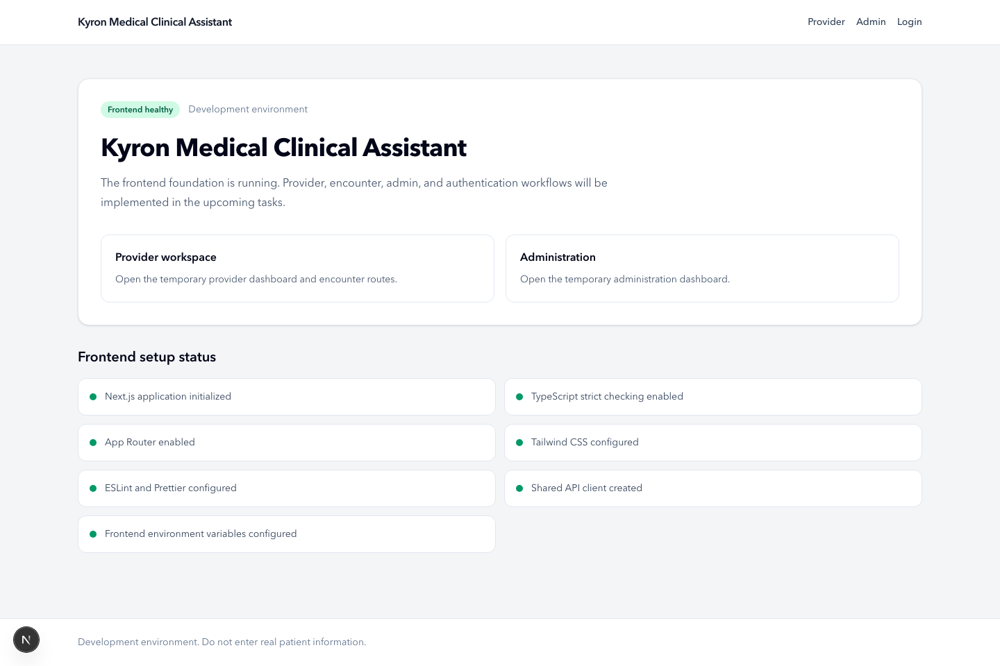
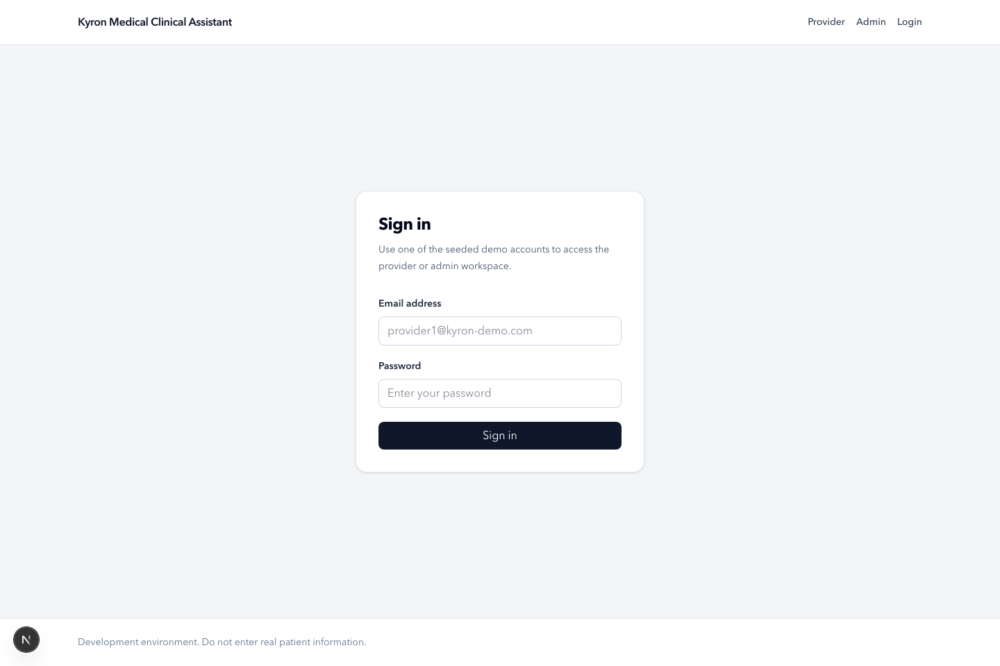
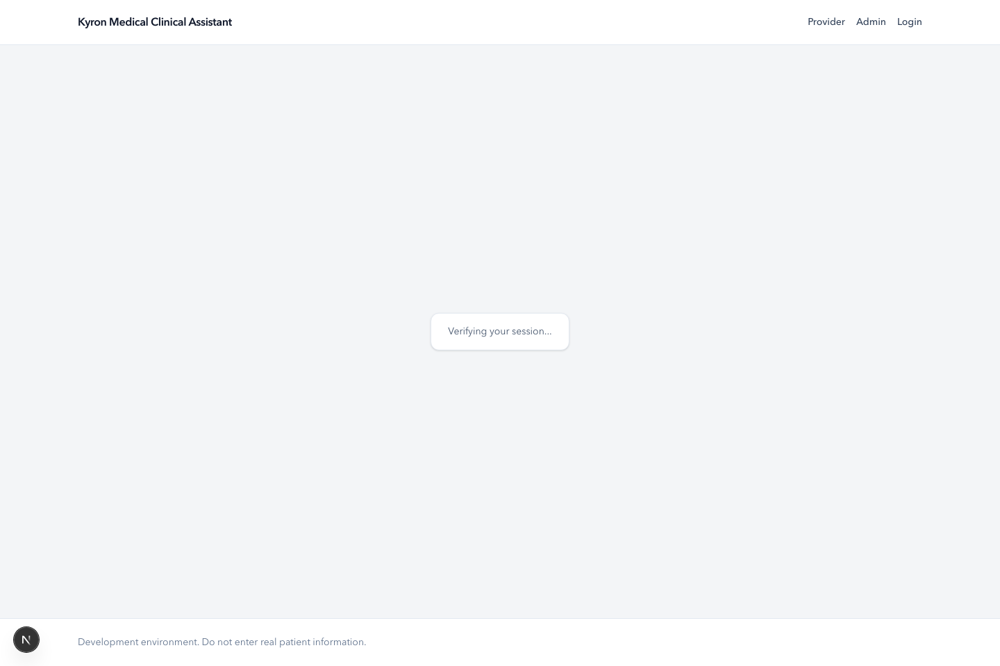
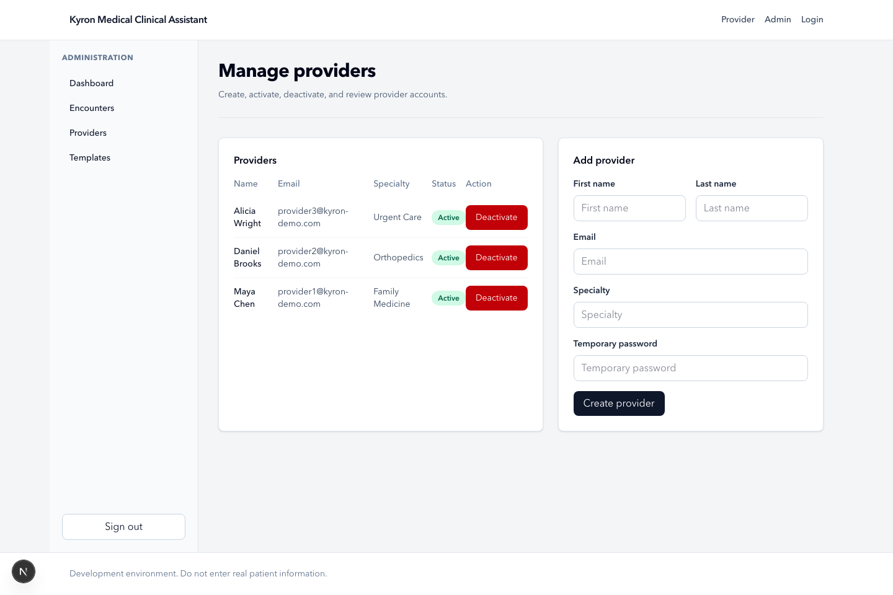
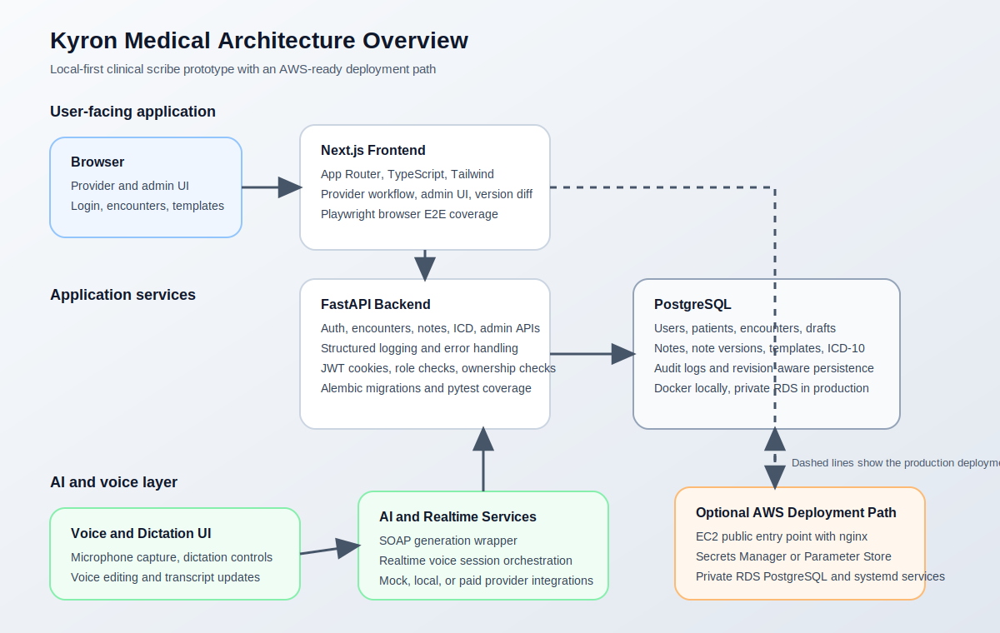

# Kyron Medical AI Clinical Scribe Platform

Kyron Medical AI Clinical Scribe Platform is a full-stack clinical documentation
prototype for provider encounters. It combines a Next.js frontend, a FastAPI
backend, PostgreSQL persistence, authentication and role-based authorization,
SOAP note generation, ICD-10 search, note versioning, admin workflows, and
browser-based voice and dictation flows.

## Live Application

- Live application link: not configured in this repository snapshot
- Deployment blueprint: [docs/09-deployment-and-infrastructure.md](docs/09-deployment-and-infrastructure.md)
- AWS design: [infrastructure/architecture.md](infrastructure/architecture.md)

If you want to keep the system cost-free, use the local workflow in this
README and treat the AWS docs as a production-ready deployment plan instead of
something you must launch right away.

## Demo Credentials

These credentials are created by `backend/scripts/seed_demo.py` for local and
demo environments only:

- `provider1@kyron-demo.com` / `DemoPass123!`
- `provider2@kyron-demo.com` / `DemoPass123!`
- `provider3@kyron-demo.com` / `DemoPass123!`
- `admin@kyron-demo.com` / `DemoPass123!`

## Screenshots

### Home



### Login



### Provider Dashboard



### Admin Provider Management



## Architecture Image



## Key Features

- Provider authentication with HTTP-only cookie-based JWT sessions
- Provider-only encounter access with ownership checks
- Admin-only provider, encounter, and template management
- Encounter creation with patient reuse and prior-history awareness
- Draft autosave with revision tracking and conflict handling
- SOAP note generation with structured output validation
- ICD-10 search with seeded local dataset
- Note saving with immutable version history and version diff comparison
- Browser-based dictation and voice-editing UI flows
- Playwright E2E coverage for login, provider, admin, dictation, and version diff

## Technology Stack

### Frontend

- Next.js 15
- React 19
- TypeScript
- Tailwind CSS 4
- Playwright

### Backend

- FastAPI
- Python
- SQLAlchemy 2
- Alembic
- Pydantic Settings
- asyncpg
- Argon2 password hashing via Passlib
- PyJWT
- pytest + httpx

### Data and Infrastructure

- PostgreSQL 16 via Docker Compose for local development
- nginx and systemd configuration for EC2 deployment
- AWS-ready RDS, Secrets Manager, and EC2 deployment design

## Project Structure

```text
.
├── backend/          FastAPI app, migrations, scripts, tests
├── frontend/         Next.js app, E2E tests, UI components
├── docs/             project, architecture, API, and deployment docs
├── infrastructure/   docker-compose, nginx, systemd, deployment scripts
└── scripts/          reserved for future repo-level automation
```

## Local Setup

### 1. Clone the repository

```bash
git clone https://github.com/Andisha2004/Kyron-Medical-AI-Clinical-Scribe-Platform.git
cd Kyron-Medical-AI-Clinical-Scribe-Platform
```

### 2. Configure environment files

```bash
cp .env.example .env
cp backend/.env.example backend/.env
cp frontend/.env.example frontend/.env.local
```

The default local configuration already points to the repo’s Docker PostgreSQL
instance on `127.0.0.1:5433`.

### 3. Install frontend dependencies

```bash
cd frontend
npm install
cd ..
```

### 4. Install backend dependencies

```bash
cd backend
python3 -m venv .venv
source .venv/bin/activate
pip install -r requirements.txt
cd ..
```

### 5. Start PostgreSQL

```bash
docker compose -f infrastructure/docker-compose.yml up -d postgres
```

### 6. Run migrations

```bash
cd backend
source .venv/bin/activate
./.venv/bin/alembic upgrade head
cd ..
```

### 7. Seed demo data

```bash
cd backend
source .venv/bin/activate
./.venv/bin/python scripts/seed_demo.py
cd ..
```

### 8. Start the backend

```bash
cd backend
source .venv/bin/activate
./.venv/bin/uvicorn app.main:app --reload
```

Backend health checks:

- [http://127.0.0.1:8000/health](http://127.0.0.1:8000/health)
- [http://127.0.0.1:8000/api/health](http://127.0.0.1:8000/api/health)

### 9. Start the frontend

Open a second terminal:

```bash
cd frontend
npm run dev
```

Frontend URL:

- [http://localhost:3000](http://localhost:3000)

## Environment Variables

### Root

- `.env.example` documents shared defaults and placeholders.

### Backend

Primary backend variables are defined in
[backend/.env.example](backend/.env.example).
Important ones:

- `DATABASE_URL`
- `JWT_SECRET_KEY`
- `ALLOWED_ORIGINS`
- `LLM_PROVIDER`
- `OPENAI_API_KEY`
- `VOICE_PROVIDER`
- `AWS_USE_RUNTIME_SECRETS`
- `AWS_SECRETS_MANAGER_SECRET_ID`
- `AWS_PARAMETER_STORE_PATH`

### Frontend

Primary frontend variables are defined in
[frontend/.env.example](frontend/.env.example).
Important ones:

- `NEXT_PUBLIC_API_BASE_URL`
- `NEXT_PUBLIC_APP_URL`
- `NEXT_PUBLIC_ENABLE_VOICE_AGENT`
- `NEXT_PUBLIC_ENABLE_ICD_SEARCH`
- `NEXT_PUBLIC_ENABLE_REALTIME_TRANSCRIPT`
- `NEXT_PUBLIC_ENABLE_BROWSER_SPEECH_FALLBACK`

Never commit real credentials to `.env`, `backend/.env`, or
`frontend/.env.local`.

## Migrations

From the backend directory:

```bash
source .venv/bin/activate
./.venv/bin/alembic upgrade head
```

If you need a quick schema bootstrap without using Alembic, the repo also
includes:

```bash
./.venv/bin/python scripts/bootstrap_demo_database.py
```

Use Alembic for normal schema management. The bootstrap script is mainly useful
for demo and test environment preparation.

## Seed Data

Seed the demo dataset with:

```bash
cd backend
source .venv/bin/activate
./.venv/bin/python scripts/seed_demo.py
```

The seed script is designed for local/demo environments and ensures:

- 3 provider accounts
- 1 admin account
- 3 note templates
- several patients
- returning-patient history
- at least 320 ICD-10 entries

## Test Instructions

### Backend tests

```bash
cd backend
source .venv/bin/activate
./.venv/bin/pytest tests -q
```

### Frontend static checks

```bash
cd frontend
npm run check
```

### Frontend browser E2E tests

```bash
cd frontend
npm run test:e2e
```

## Deployment Summary

The repository includes a production deployment blueprint but does not require a
paid cloud deployment to function locally.

### Local, cost-conscious default

- Next.js on `localhost:3000`
- FastAPI on `127.0.0.1:8000`
- PostgreSQL via Docker on `127.0.0.1:5433`

### Production target

- Public EC2 instance with nginx
- FastAPI and Next.js bound to localhost only
- Private RDS PostgreSQL
- Secrets Manager or Parameter Store for runtime secrets

See:

- [docs/09-deployment-and-infrastructure.md](docs/09-deployment-and-infrastructure.md)
- [infrastructure/README.md](infrastructure/README.md)

## Security Note

- Authentication uses JWT access tokens stored in an HTTP-only cookie
- Authorization is enforced through role dependencies and encounter ownership checks
- Passwords are hashed with Argon2 and are never stored in plaintext
- Production database design assumes private RDS access only
- Runtime secret loading supports AWS Secrets Manager and SSM Parameter Store
- Audit logging is designed to minimize sensitive clinical content

See the full security write-up in
[docs/10-security-documentation.md](docs/10-security-documentation.md).

## Synthetic Data Disclaimer

This prototype is intended to be demonstrated with synthetic, fictional, or
de-identified data only. The seed data and demo credentials in this repository
are for local development and demonstration, not for real patient use.

## Limitations

- No live public deployment URL is configured in this repository snapshot
- Voice, realtime, and AI features may require provider credentials if you move
  beyond mocked/local development modes
- The repository includes AWS deployment artifacts, but launching AWS resources
  will create real cloud costs
- This is a prototype and not a production medical system or a HIPAA-compliant
  deployment by itself

## Documentation Links

- [docs/01-project-overview.md](docs/01-project-overview.md)
- [docs/02-requirements.md](docs/02-requirements.md)
- [docs/03-use-cases-and-user-flows.md](docs/03-use-cases-and-user-flows.md)
- [docs/04-frontend-design.md](docs/04-frontend-design.md)
- [docs/05-system-architecture.md](docs/05-system-architecture.md)
- [docs/06-database-design.md](docs/06-database-design.md)
- [docs/07-api-design.md](docs/07-api-design.md)
- [docs/08-ai-architecture.md](docs/08-ai-architecture.md)
- [docs/09-deployment-and-infrastructure.md](docs/09-deployment-and-infrastructure.md)
- [docs/10-security-documentation.md](docs/10-security-documentation.md)
- [docs/11-developer-setup.md](docs/11-developer-setup.md)
